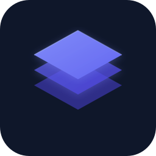

<p align="center">
  
</p>

<h1 align="center">PromptLayer Desktop</h1>

<p align="center">
  <strong>System-wide AI prompt enhancer.</strong><br>
  Summon anywhere. Enhance instantly. Insert back.
</p>

<p align="center">
  
  
  
</p>

---

## What is PromptLayer?

PromptLayer is a lightweight desktop app that lives in the background. Press a global shortcut from **any application** and a floating window appears. Paste or type a prompt, enhance it with AI, then insert the improved version back — all without leaving your current workflow.

## Features

- **Global shortcut** — `Ctrl+Shift+L` summons the window from anywhere
- **Auto-capture** — Automatically reads your clipboard when opened
- **Single optimization pipeline** — Enhance, Expand, Clarify, or go Advanced
- **One-click insert** — Writes the enhanced prompt to your clipboard and simulates `Ctrl+V`
- **Multi-provider support** — OpenAI, Google Gemini, Groq, OpenRouter, or any OpenAI-compatible API
- **Encrypted storage** — API keys are stored encrypted on disk via electron-store
- **Zero background polling** — Event-driven architecture, near-zero idle CPU
- **Frameless floating UI** — Always-on-top, auto-hides on blur, opens in <120ms

## Installation

### Prerequisites

- [Node.js](https://nodejs.org/) v18+ (LTS recommended)
- An API key from your preferred provider (OpenAI, Gemini, Groq, etc.)

### Setup

```bash
# Clone the repository
git clone https://github.com/gunatarun007/promptlayer-desktop.git
cd promptlayer-desktop

# Install dependencies
npm install

# Launch the app
npm start
```

On first launch, click the **⚙ Settings** icon and enter your API key.

## Building for Distribution

```bash
# Build Windows installer (NSIS) + portable .exe
npm run build:win
```

Output files will be in the `dist/` directory:

| File | Description |
|------|-------------|
| `PromptLayer Setup 1.0.0.exe` | NSIS installer |
| `PromptLayer-Portable-1.0.0.exe` | Standalone portable executable |

## Usage

| Action | Shortcut |
|--------|----------|
| Open / close window | `Ctrl+Shift+L` |
| Enhance prompt | `Ctrl+Enter` |
| Close window | `Escape` |
| Auto-hide | Click outside the window |

### Workflow

1. **Select text** in any application
2. **Copy** it (`Ctrl+C`)
3. Press **`Ctrl+Shift+L`** — PromptLayer opens with your text pre-filled
4. Click **Enhance** (or pick Expand / Clarity / Advanced)
5. Click **Insert** — the enhanced prompt is pasted back into your app

### Supported Providers

| Provider | API Base |
|----------|----------|
| OpenAI | `https://api.openai.com/v1` |
| Google Gemini | `https://generativelanguage.googleapis.com/v1beta/openai` |
| Groq | `https://api.groq.com/openai/v1` |
| OpenRouter | `https://openrouter.ai/api/v1` |
| Custom | Any OpenAI-compatible endpoint |

## Project Structure

```
desktop/
├── main.js              # Electron main process
├── preload.js           # Context bridge (IPC API)
├── lib/
│   └── optimizer.js     # Single optimization pipeline
├── renderer/
│   ├── index.html       # UI markup
│   ├── styles.css       # Design system
│   └── app.js           # Renderer logic
├── assets/
│   ├── icon.svg         # App icon (source)
│   └── icon.png         # App icon (256×256)
└── package.json         # Manifest + electron-builder config
```

## Architecture

```
┌──────────────────────────────────────────────────┐
│                    Main Process                   │
│                                                   │
│   ┌──────────┐  ┌──────────┐  ┌──────────────┐  │
│   │ Shortcut │  │  Store   │  │  Optimizer   │  │
│   │ Manager  │  │ (encrypted)│ │  Pipeline    │  │
│   └────┬─────┘  └─────┬────┘  └──────┬───────┘  │
│        │              │               │           │
│        └──────────────┼───────────────┘           │
│                       │ IPC                       │
├───────────────────────┼──────────────────────────┤
│               Preload Bridge                      │
│          (contextBridge / typed API)              │
├───────────────────────┼──────────────────────────┤
│                Renderer Process                   │
│                                                   │
│   ┌──────────┐  ┌──────────┐  ┌──────────────┐  │
│   │   Input  │  │  Chips   │  │   Results    │  │
│   │ Textarea │  │   Bar    │  │   Panel      │  │
│   └──────────┘  └──────────┘  └──────────────┘  │
└──────────────────────────────────────────────────┘
```

## Security

- **Context isolation** — Renderer has zero direct Node.js access
- **Sandbox** — Renderer runs in a sandboxed process
- **Encrypted settings** — API keys encrypted at rest via electron-store
- **No devtools in production** — DevTools disabled when app is packaged
- **CSP enforced** — Content Security Policy set in HTML meta tag
- **No hardcoded secrets** — All config from user settings only

## License

MIT © [PromptLayer](https://github.com/gunatarun007)
